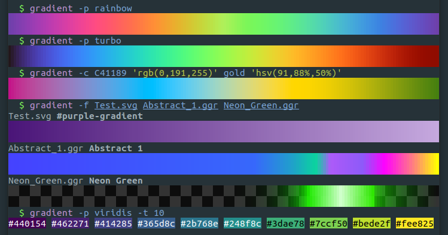

# `gradient`

[](https://github.com/mazznoer/gradient-rs/actions)
[](https://crates.io/crates/gradient)

A command-line tool for playing with color gradients.



## Features

* Lots of preset gradients.
* Custom gradient.
* Read gradients from SVG & GIMP gradient (ggr) file.
* Display gradient in the terminal.
* Get colors from gradient.

## Installation

Pre-compiled binaries for Linux, macOS and Windows is avaliable on [release page](https://github.com/mazznoer/gradient-rs/releases).

### Cargo

`gradient` can be installed with [cargo](https://www.rust-lang.org/tools/install).

```shell
cargo install gradient
```

### NetBSD

On NetBSD, a pre-compiled binary is available from the official repositories.
To install it, simply run:

```shell
pkgin install gradient
```

## Usage

```
gradient [OPTIONS]
```

### Options:

* `-W`, `--width` `<NUM>` : Gradient display width (default: terminal width)
* `-H`, `--height` `<NUM>` : Gradient display height (default: 2)
* `-b`, `--background` `<COLOR>` : Background color (default: checkerboard)
* `--cb-color` `<COLOR>` `<COLOR>` : Checkerboard color
* `-s`, `--sample` `<FLOAT>`... : Get color(s) at specific position
* `-t`, `--take` `<NUM>` : Get N colors evenly spaced across gradient
* `-o`, `--format` `<FORMAT>` : Output color format (default: hex) [hex, rgb, rgb255, hsl, hsv, hwb]
* `-a`, `--array` : Print colors as array

### Preset gradient

* `-p`, `--preset` `<NAME>` : Using the preset gradient
* `-l`, `--list-presets` : Lists all available preset gradient names

### Custom gradient

* `-c`, `--custom` `<COLOR>`... : Create custom gradient
* `-m`, `--blend-mode` `<MODE>` : Custom gradient blending mode (default: oklab) [rgb, linear-rgb, hsv, oklab]
* `-i`, `--interpolation` `<MODE>` : Custom gradient interpolation mode (default: catmull-rom) [linear, basis, catmull-rom]
* `-P`, `--position` `<FLOAT>`... : Custom gradient color position

### Gradient file

* `-f`, `--file` `<FILE>`... : Read gradient from SVG or GIMP gradient (ggr) file(s)
* `--ggr-fg` `<COLOR>` : GGR foreground color (default: black)
* `--ggr-bg` `<COLOR>` : GGR background color (default: white)
* `--svg-id` `<ID>` : Pick one SVG gradient by ID

`COLOR` can be specified using [CSS color format](https://www.w3.org/TR/css-color-4/).

## Usage Examples

Get 100 colors (evenly spaced accross gradient domain) from rainbow preset gradient.

```shell
gradient -p rainbow -t 100
```

Display all gradients from svg file.

```shell
gradient -f file.svg
```

Create custom gradient.

```shell
gradient -c gold ff4700 'rgb(90,230,170)' 'hsl(340,50%,50%)' 'hsv(270,60%,70%)' 'hwb(230,50%,0%)'
```

**TODO** add more examples

