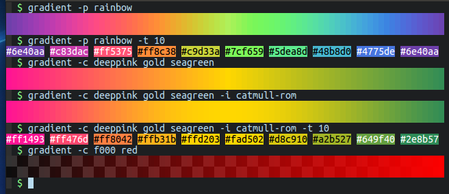

# `gradient`

[](https://github.com/mazznoer/gradient-rs/actions)

A command-line tool for playing with color gradient.



## Features

* Lots of preset gradients.
* Custom gradient.
* Read gradients from SVG & GIMP gradient (ggr) file.
* Display gradient in the terminal.
* Get colors from gradient.

## Installation

`gradient` can be installed with [cargo](https://www.rust-lang.org/tools/install).

```shell
cargo install gradient
```

## Usage

```
gradient [OPTIONS]
```

### Options:

* `-W`, `--width` : Gradient display width (default: terminal width)
* `-H`, `--height` : Gradient display height (default: 2)
* `-b`, `--background` : Background color (default: checkerboard)
* `-s`, `--sample` : Get color(s) at specific position
* `-t`, `--take` : Get N colors evenly spaced across gradient
* `-o`, `--format` : Output color format (default: hex) [hex, rgb, rgb255, hsl, hsv, hwb]

### Preset gradient

* `-p`, `--preset` : Using the preset gradient
* `-l`, `--list-presets` : Lists all available preset gradients

### Custom gradient

* `-c`, `--custom` : Create custom gradient
* `-m`, `--blend-mode` : Custom gradient blending mode (default: oklab) [rgb, linear-rgb, hsv, oklab]
* `-i`, `--interpolation` : Custom gradient interpolation mode (default: catmull-rom) [linear, basis, catmull-rom]
* `-P`, `--position` : Custom gradient color position

### Gradient file

* `-f`, `--file` : Read gradient from SVG or GIMP gradient (ggr) file(s)
* `--ggr-fg` : GGR foreground color (default: black)
* `--ggr-bg` : GGR background color (default: white)
* `--svg-id` : Pick SVG gradient by ID

## Usage Examples

Get 100 colors (evenly spaced accross gradient domain) from rainbow preset gradient.

```shell
gradient -p rainbow -t 100
```

Display all gradients from svg file.

```shell
gradient -f file.svg
```

Create custom gradient. Colors can be specified using CSS color format.

```shell
gradient -c gold ff4700 'rgb(90,230,170)' 'hsl(340,50%,50%)' 'hsv(270,60%,70%)' 'hwb(230,50%,0%)'
```

TODO add more examples

